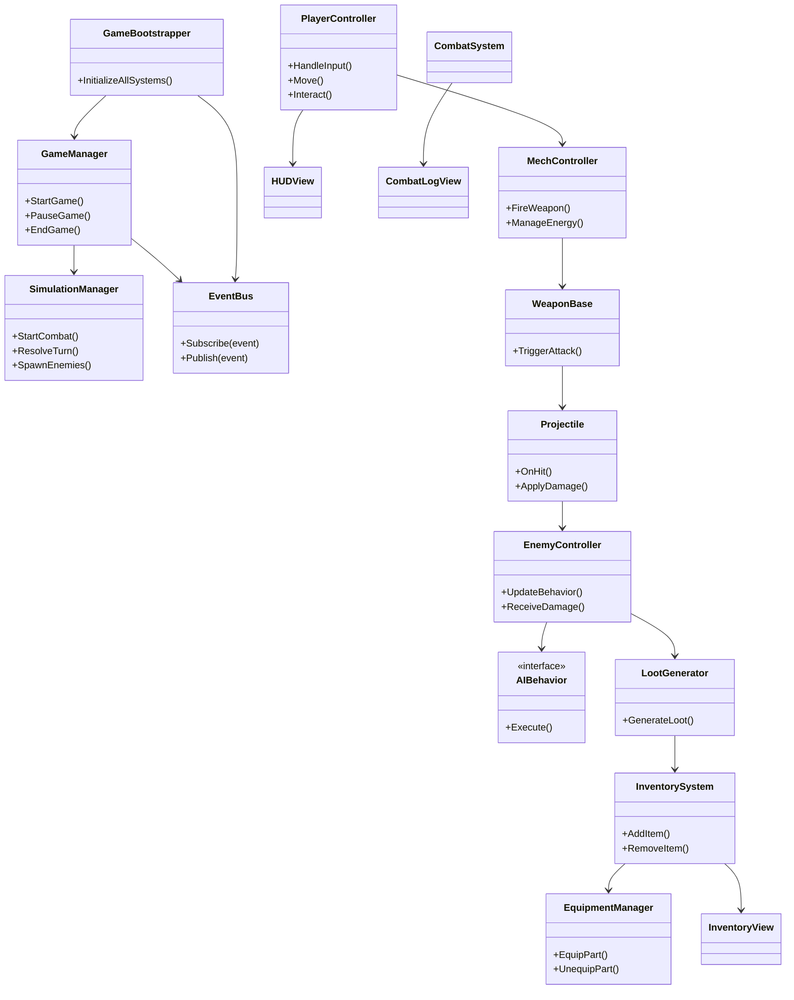

# 🎮 MECH SALVAGER — Game Development Bible

A complete, modular document combining GDD, TDD, project roadmap, testing plan, and business strategy.

## ⚡ TL;DR – Mech Salvager Game Development Bible

> A quick reference overview summarizing the key takeaways from each major section of this document.

| Section | Summary |
|--------|---------|
| **1. Executive Summary** | A 2D tactical platformer where players pilot customizable mechs, defeat enemies, salvage parts, and upgrade loadouts across short, replayable runs. |
| **2. Game Vision & Identity** | Core design pillars include weighty combat, risk-reward salvage mechanics, and tactical progression through loadout building. |
| **3. Core Game Loops** | Fight → Salvage → Equip → Fight Better. Loop structures: core (30s), session (5m), meta (30m). |
| **4. Player Experience Journey** | Focuses on a satisfying early game tutorial, mastery through repetition, and continual reward through loot and upgrades. |
| **5. Phase Development Roadmap** | Outlines the game's development across 10 phases, each with clear milestones and evolving functionality. |
| **6. Systems Architecture** | Modular MVC + Event-driven + ScriptableObject-based architecture; scalable and highly decoupled. |
| **7. Content & Scope** | Prioritizes modular mech parts, enemy variety, and layered combat environments; features are grouped into MVP, stretch, and polish categories. |
| **8. Technical Specifications** | Unity (URP), modular C# architecture, ECS-inspired structure, version-controlled pipeline, YAML task breakdowns for AI integration. |
| **9. Art & Audio Direction** | Chunky industrial pixel art with impactful audio feedback; modular part visuals and enemy silhouettes prioritized. |
| **10. Feel Document** | Emphasizes weighty controls, deliberate pacing, satisfying combat, and strategic decision-making. |
| **11. Testing & Validation** | Automated unit tests, playtesting loops, and a validation matrix for key features and edge cases. |
| **12. Success Metrics** | Qualitative and quantitative indicators: player retention, upgrade usage, tactical variety, and narrative engagement. |
| **13. Risk Management** | Identifies technical, design, and production risks with mitigation strategies and tracking priorities. |
| **14. Resource Planning** | Estimation of time, budget, roles, tools, and outsourcing plans to support a solo-to-small team pipeline. |
| **15. Release & Monetization Strategy** | PC-first launch (Steam), premium pricing, potential for future DLC or expansion; demo release for visibility. |
| **16. Live Development Log** | Ongoing structured dev journal with phase-level updates, blockers, and AI interaction logs. |


---

## 1. Executive Summary

### **🎮 Game Overview**

**Title:**

Mech Salvager

**Genre:**

2D Platformer + Tactical Combat + Simulation Loop + Roguelike

**Platform:**

PC (Steam) — Console possible post-launch

**Target Playtime per Run:**

3–5 hours

**Setting Summary:**

A post-industrial future where players pilot customizable mechs, scavenging high-tech ruins for parts and surviving hostile warzones filled with remnants of the past.

---

### **💡 Core Concept**

> “A deliberate-action platformer where every movement matters and every shot affects your loot. You’re not just surviving—you’re upgrading.”
> 

Players engage in high-stakes combat and looting, where tactics and restraint matter as much as firepower. The loop revolves around **combat**, **salvage**, and **mech customization**.

---

### **🧠 Design Philosophy (Optional Toggle or Callout)**

- **Deliberate movement:** Every action has cost and weight.
- **Persistent progression:** Success comes from tactical upgrades over time.
- **Reactive systems:** What you destroy changes what you can loot.
- **Short, replayable runs:** Optimized for iteration and experimentation.

---

### **🎯 Target Audience**

| **Segment** | **Why It Resonates** |
| --- | --- |
| **Mech Fans** | Deep customization, gritty tone (e.g., *Titanfall*) |
| **Roguelike Players** | Procedural variation and modular progression |
| **Tactical Gamers** | Combat rewards planning and mechanical understanding |
| **13+ Age Range** | Aesthetic, challenge, and accessible complexity |

---

### **🔑 Unique Selling Points (USPs)**

1. **Precision Tactical Platforming** – Movement and weapons feel impactful and intentional.
2. **Loot-Driven Combat Decisions** – What you kill with affects what parts you recover.
3. **Hybrid Loop Design** – Combines platforming, tactical gear management, and economic meta.
4. **Replayability via Meta Loadouts** – Short runs, big strategic variance, lots of content.

---

## **🎨 2. Game Vision & Identity**

---

### **🔧 Core Design Pillars**

These foundational ideas drive all design and development decisions.

| **Pillar** | **Description** |
| --- | --- |
| 🦾 **Weighty Combat** | Every movement has consequence; combat feels mechanical and deliberate. |
| 💥 **Risk-Reward Salvage** | The weapon you use determines the parts you can salvage. Strategic restraint is key. |
| 🧠 **Tactical Progression** | There is no best build—only adaptations to your style and playthrough path. |

---

### **🎮 Key Influences**

Inspiration from iconic games that shape tone, mechanics, and design. 

| **Game** | **Influence Focus** |
| --- | --- |
| **Battletech** | Salvage and combat |
| **Mega Man X** | Precision platforming and fast-paced combat |
| **FTL** | Strategic decisions with cascading outcomes |
| **Dead Cells** | Modular gear loadouts and replayability |
| **Into the Breach** | Small scope, deep interaction |
| **SteamWorld Dig** | Mining + upgrade loop with world progression |

---


### 🧩 Core Mechanics & Features

This subsection outlines the key mechanical systems that define Mech Salvager’s gameplay moment-to-moment and across sessions. These are the foundational interactive features that create depth, strategy, and engagement.

#### ⚔️ Combat System
- **Deliberate Firing**: All weapons have cooldowns, energy costs, and impact behavior.
- **Weapon Types**: Includes light, heavy, and melee categories with different ranges, fire rates, and salvage impact.
- **Enemy Targeting**: Aim for limbs vs. core to influence loot drops and encounter tactics.
- **Hit Feedback**: Knockback, hitpause, SFX/VFX reinforce weight and damage.

#### 🦾 Mech Customization
- **Part-Based Loadouts**: Arms, legs, core, boosters, and sensors can be swapped.
- **Visual Representation**: Equipping parts updates mech sprite dynamically.
- **Stat Modifiers**: Each part impacts movement, damage, energy capacity, and resistances.

#### 🔋 Energy & Resource Management
- **Energy Economy**: All abilities consume energy. Players must decide between offense and mobility.
- **Recharge Logic**: Energy regenerates slowly out of combat or through gear bonuses.

#### 💥 Salvage System
- **Conditional Loot Drops**: Weapon used to kill enemy affects quality and type of loot.
- **Salvage Tiers**: Parts are tiered by rarity and integrity.
- **Trade-Off Mechanic**: Blasting enemies might destroy parts. Precision yields better salvage.

#### 📦 Inventory & Equipment
- **Modular Equipment System**: Parts are equipped to chassis slots and provide additive bonuses.
- **Weight System**: Heavier parts limit movement/dash capability, reinforcing trade-offs.

#### 🧠 Progression Systems
- **XP & Leveling**: Combat and quests award XP. Levels increase base stats and unlock abilities.
- **Unlockable Loadouts**: New chassis and starting gear become available with meta-progression.

#### 🧭 Procedural Level Segments
- **Zone Structure**: Each session consists of semi-randomized zones with increasing difficulty.
- **Biome Affordances**: Unique hazards, visuals, and enemy mixes per biome.

#### 🧩 Quests & Narrative Triggers
- **Emergent Events**: Key gameplay actions (e.g., salvaging a core) trigger optional narrative beats.
- **Quest Chains**: Simple, system-connected goals provide light structure.

#### 🖥️ UI/UX Design
- **Tactile HUD**: Health, energy, XP, and gear stats are always visible.
- **Inventory View**: Allows quick stat comparison, drag-and-drop equipping.
- **Combat Log**: Optional floating combat text shows damage, crits, and loot drops.

### **🎭 Tone & Emotional Experience**

What players should **feel**

- **Powerful but precise:** You feel like a badass—but not invincible.
- **Deliberate and thoughtful:** Every decision is tactical, every mistake costly.
- **Tension of choice:** Blast an enemy to bits… or preserve parts for upgrades?
- **Satisfying mastery:** Gradually understanding how to optimize loadouts and tactics.

---

### **🧱 Narrative & World Identity (Optional Expansion Block in Notion)**

- A **salvage-fueled economy** in the aftermath of endless mech wars.
- You’re a lone pilot—scavenger, engineer, and mercenary—trying to survive in the wreckage.
- There are no pristine heroes—just broken machines and the ingenuity to survive.
- Exploration is environmental storytelling: rusted titans, fractured bunkers, haunting echoes of old wars.

---

## **🔄 3. Core Game Loops**

Mech Salvager’s gameplay is structured into **three nested loops** 

---

### **⚙️ CORE LOOP —**

### **30 seconds**

**Fight → Salvage → Equip → Fight Better**

**Purpose:**

This is the heart of the minute-to-minute gameplay. It captures the moment-to-moment satisfaction of engaging enemies, looting the battlefield, and making fast tactical decisions.

**Key Activities:**

- Navigate terrain with precision
- Engage in short, intense mech battles
- Choose whether to destroy enemies completely or preserve parts
- Collect dropped gear and immediately upgrade your loadout

**Design Goals:**

- Every shot has consequences (e.g., part destruction vs preservation)
- Combat flow feels satisfying and responsive
- Quick visual/mechanical feedback loop

---

### **🧰 SESSION LOOP —**

### **5–10 minutes**

**Clear Area → Collect Parts → Upgrade → Enter Harder Area**

**Purpose:**

This loop captures a single “run segment”—moving through one biome or enemy cluster. It focuses on collecting and assembling mech parts to prepare for greater challenges.

**Key Activities:**

- Explore an environment or sector
- Accumulate multiple salvaged parts
- Make strategic upgrade decisions (swap, stack, sell)
- Push forward into more dangerous terrain

**Design Goals:**

- Create short-term goals and local decision trees
- Introduce escalating difficulty and variety
- Reinforce the cause-effect relationship of previous loop

---

### **🧠 META LOOP —**

### **30–60+ minutes**

**Build Loadout → Master Playstyle → Unlock Gear → Experiment**

**Purpose:**

This loop gives structure to full playthroughs and repeat sessions. It emphasizes build diversity, replayability, and longer-term player mastery.

**Key Activities:**

- Plan an initial loadout or playstyle (ranged, melee, hybrid)
- Adapt builds based on loot and encounters
- Unlock new gear, weapons, and parts for future runs
- Replay with different strategies and loadout synergies

**Design Goals:**

- Encourage experimentation and personal expression
- Provide meaningful meta-progression
- Support replayability with persistent rewards and unlocks

---

### **🎯 Summary Table (Optional in Notion)**

| **Loop** | **Duration** | **Player Focus** | **Design Purpose** |
| --- | --- | --- | --- |
| **Core** | ~30 sec | Immediate combat & looting | Satisfying moment-to-moment gameplay |
| **Session** | ~5–10 min | Tactical area clearing | Medium-term gear management & escalation |
| **Meta** | ~30–60+ min | Strategy & replayability | Long-term progression & experimentation |

---

## **🎯 4. Player Experience Journey**

> This section outlines the emotional and cognitive experience of a typical player as they move through their first session and beyond. It maps how player perception evolves with growing familiarity and mastery.
> 

---

### **📘 Staged Player Journey**

| **Time** | **Player Experience** | **Design Objective** |
| --- | --- | --- |
| **Minute 1** | *“This mech feels powerful!”* | Hook the player with tactile, weighty movement and shooting. |
| **Minute 10** | *“Weapon choice affects loot? Interesting…”* | Introduce mechanics that reward experimentation and restraint. |
| **Hour 1** | *“Look at my new loadout!”* | Show visible/mechanical progression; foster personal investment. |
| **Hour 3+** | *“What if I tried a full melee build?”* | Encourage replayability and divergent builds. |

---

### **🧠 Cognitive & Emotional Flow**

This journey isn’t just mechanical—it’s about how the player **feels** and what they’re motivated by:

1. **Curiosity** – How do movement and combat work?
2. **Discovery** – Loot matters? Weapon choice has consequence?
3. **Control** – I understand how to optimize and synergize parts.
4. **Expression** – I’m building a mech that reflects my playstyle.
5. **Mastery & Replay** – I want to try again, better, or differently.

---

### **🚀 Progression Experience Touchpoints**

| **Trigger** | **Player Realization** | **Supporting Systems** |
| --- | --- | --- |
| Salvaging a partially intact enemy | “I got better parts by being careful!” | Destructibility, loot system |
| Switching weapons mid-run | “This gun fits better with my build.” | Loadout system, quick inventory access |
| Facing a new enemy type | “I need a new tactic to beat this one.” | Enemy variety, telegraphed attacks |
| Finishing a biome with no repairs used | “I’m actually getting good at this.” | Resource scarcity, risk-reward loop |
| Unlocking a new chassis/loadout | “Can’t wait to try this next run.” | Meta-loop progression & unlocks |

---

### **🌀 Design Implications**

- Players must **feel smart** for discovering optimization pathways.
- The **first 10 minutes** are critical for tactile enjoyment and clarity.
- A smooth arc from **discovery → control → mastery → expression** makes each run satisfying, and the next one enticing.

---

## 📅 5. Phase Development Roadmap
| Phase | Game State & Description | Key Systems | Key Assets | Outcomes | Why It's Fun | What's Missing (Next Phase) |
| --- | --- | --- | --- | --- | --- | --- |
| **Phase 1: Core Movement & Combat** | Minimal vertical slice. Player can walk, jump, dash, shoot, and destroy a stationary dummy enemy. Single room test scene. | `PlayerController`, `MechController`, `WeaponBase`, `Projectile`, `CombatSystem`, `GameManager`, `EventBus` | Basic mech sprite, projectile prefab, dummy enemy prefab, `HUDView` UI | First playable build. Validates mech 'feel', combat feedback, and controls. | Satisfying movement + immediate feedback from shooting. Establishes mech power fantasy. | No enemy AI. Combat lacks tension. No salvage or progression loop. |
| **Phase 2: Enemy AI & Movement** | Enemies move, patrol, and chase player. Combat feels dynamic and reactive. Small combat arena now populated with basic threats. | `EnemyController`, `AIBehavior`, `EnemyDefinitionSO` | Enemy sprites (patroller, chaser), basic patrol paths, detection zones | Combat scenarios feel alive. Enemies are no longer passive. | Engaging in dynamic combat requires adaptation and tactical movement. | Still no loot system or reward feedback. Combat doesn't impact player progression. |
| **Phase 3: Salvage System + Inventory** | Enemies drop randomized salvage. Loot appears visually and is added to a functional inventory screen. | `SalvageSystem`, `LootGenerator`, `InventorySystem`, `InventoryView` | Loot icons, part rarity indicators, basic inventory UI | First reward loop is formed. Enemy encounters provide tangible upgrades. | Immediate gratification from loot. Visual rewards after battle. | Loot is passive; no equipping or stat impact yet. |
| **Phase 4: Combat Modularization + Basic XP** | Weapon and enemy stats are defined via ScriptableObjects. Basic XP tracking rewards combat engagement. Easy to tweak and test new gear/enemies. | `WeaponSO`, `MechPartSO`, `CombatConfigSO`, `DamageCalculator`, `XPManager` (basic) | Config SOs, FX for hits, modular combat visuals, XP bar UI | Tuning and balance are now possible. Visual polish adds weight to actions. Basic progression motivation established. | Weapons feel distinct. Combat gets deeper with varied feedback. Players see immediate progress from fights. | Loot is still cosmetic. No way to equip or alter player build. XP has no meaningful impact yet. |
| **Phase 5: Equipment System + Enemy Variants** | Players can equip salvaged parts that modify stats and are visually represented. Multiple basic enemy types provide varied challenges for testing equipment builds. | `EquipmentManager`, `IEquippable`, `StatModifiers`, 2-3 basic `AIBehavior` variants | Equipment icons, equip slots, visual part overlays, 2-3 enemy sprite variants | Gear affects gameplay and can be tested against varied threats. Loadout changes are immediately validated against different enemy types. | Player expression emerges through builds. Different enemies require different approaches, making equipment choices meaningful. | Enemy behaviors are still basic. Need more sophisticated AI and tactical depth. Full progression system missing. |
| **Phase 6: Advanced Enemy Behaviors + Combat Depth** | Multiple enemy types with sophisticated behaviors and AI routines. Some rush, some snipe, others shield allies. Enemies synergize and challenge different build types. | `AIManager`, expanded `EnemyDefinitionSO`, multiple advanced `AIBehavior` strategies | New enemy sprites, ranged/melee FX, shield visuals, formation behaviors | Combat depth improves dramatically. Tactical decisions become critical. Equipment builds have clear counters and synergies. | Requires adaptation and strategy. No single build dominates. Combat feels like tactical puzzles. | Progression system is too basic. Power gains lack structure and long-term goals. |
| **Phase 7: Full Progression System** | Players gain XP and level up with meaningful stat increases. Progression curves are defined by `StatGrowthProfileSO`. Level-ups unlock new equipment tiers and abilities. | `LevelSystem`, `StatGrowthProfileSO`, expanded `XPManager`, unlock systems | Level-up FX, detailed XP/progression UI, unlock notification systems | Long-term progression provides structure to equipment hunting. Clear advancement goals motivate continued play. | Even failed runs feel productive. Satisfying player improvement with clear milestones. Unlocks create anticipation. | Still lacks story or world context. Gameplay is systemically driven only. |
| **Phase 8: Narrative Integration + Quests** | Combat milestones and salvage discoveries trigger lightweight narrative events. Basic quests provide optional goals tied to gameplay systems. | `NarrativeManager`, `EventInterpreter`, `QuestSystem`, `NarrativeEventSO` | Narrative logs, flavor popups, quest tracker UI, story trigger configs | Worldbuilding begins. Play sessions feel purposeful beyond mechanics. Systems gain context and meaning. | Story enhances immersion. Quests add direction and context to salvaging. World feels reactive to player actions. | Presentation still lacks polish. UI and flow need refinement. |
| **Phase 9: UI & UX Polish** | All systems now supported with polished UI. Controller + KBM friendly. Feedback is clear and consistent across all interactions. | `HUDController`, `UIEventSystem`, `CombatLogView`, `InputManager` | Refined UI prefabs, sounds, animations, input icons | Players feel in control. Game is legible and reactive. All systems accessible and intuitive. | Clean, satisfying UX improves flow and reduces friction. Professional feel increases player confidence. | Gameplay arenas still flat. Needs traversal challenge and environmental variety. |
| **Phase 10: Level Design + Environment** | Levels now feature verticality, hazards, and destructible terrain. Combat and traversal fully integrated with environmental tactics. | `LevelSystem`, `Platform`, `Hazard`, `DestructibleObject`, `EnvironmentalTrigger` | Tilesets, hazard FX, environmental props, destructible prefabs | Pacing becomes dynamic. Environments matter tactically. Combat gains spatial complexity. | Strategic movement and environmental usage. Emergent tactics. Levels feel alive and interactive. | No save/load system. Can't carry progress between sessions or tune gameplay effectively. |
| **Phase 11: Save/Load + Analytics & Tuning** | Game state is persistent across sessions. Designers can log metrics and tune content dynamically. Analytics inform balance decisions. | `SaveLoadManager`, `ConfigSO` tuning tools, `AnalyticsLogger`, `BalancingTools` | Save icons, debug console, balance sheets, analytics dashboard | Supports long-form playtesting and player retention. Design iteration accelerates. Data-driven balance improvements. | Players can progress meaningfully across sessions. Game feels polished and responsive to feedback. | Post-launch content expansions, advanced features, community tools. |


## 6. Systems Architecture

### 🧠 6.1 System Overview

The game uses a modular, event-driven architecture split into logical subsystems:

- **Core Management**: Bootstraps the game and manages global flow (`GameManager`, `SimulationManager`, `GameBootstrapper`).
- **Player & Mech Control**: Handles player input, mech logic, and combat execution (`PlayerController`, `MechController`, `WeaponBase`).
- **Combat & Damage**: Manages all combat logic and resolution (`CombatSystem`, `DamageCalculator`, `Projectile`).
- **Enemy AI**: Contains all enemy logic, behaviors, and AI switching (`EnemyController`, `AIBehavior`, `EnemyDefinitionSO`).
- **Loot & Salvage**: Calculates loot drops and connects to inventory (`LootGenerator`, `LootTableSO`, `SalvageSystem`).
- **Inventory & Equipment**: Tracks player loadout and stats (`InventorySystem`, `EquipmentManager`, `IEquippable`, `StatModifiers`).
- **UI & Feedback**: Displays player stats, logs, equipment, and combat info (`HUDView`, `CombatLogView`, `InventoryView`).
- **Data & Events**: Uses ScriptableObjects to store config and drive decoupled communication (`GameEventSO`, `MechPartSO`, etc.).

This design supports separation of concerns, testability, and extensibility.

### 🧰 6.2 Class Diagram (Mermaid)

The following Mermaid diagram provides a visual overview of the primary gameplay systems and their relationships. Each class represents a core component within the game’s modular architecture, following principles of separation of concerns and loose coupling.

**Key system groups:**
- `GameManager`, `SimulationManager`, and `GameBootstrapper` coordinate high-level game flow and lifecycle.
- `PlayerController` and `MechController` handle player input, mech behavior, and shooting.
- `WeaponBase` and `Projectile` define weapon firing logic and collisions.
- `EnemyController` and `AIBehavior` govern enemy behavior and decision-making.
- `LootGenerator`, `InventorySystem`, and `EquipmentManager` manage the salvage loop and loadout customization.
- `HUDView`, `CombatLogView`, and `InventoryView` provide real-time UI feedback.
- `EventBus` facilitates decoupled messaging between systems.

Arrows (`-->`) indicate directional relationships or data flows, e.g., which systems invoke or depend on others.




### 🧩 6.X Core Code Architecture Approaches

This project follows several foundational code architecture principles to ensure modularity, scalability, and clarity across all systems:

- **🧠 Event-Driven Architecture**  
  Systems communicate through a centralized `EventBus` or `GameEventSO`, reducing tight coupling and increasing flexibility. Events are broadcast and listened to, allowing systems to remain independent.

- **🧱 MVC (Model-View-Controller)**  
  UI and system interfaces are built using an MVC pattern. Data (Model), presentation (View), and logic (Controller) are decoupled for better maintenance and testability. Examples: `InventoryView`, `InventoryController`.

- **📦 ScriptableObject-Driven Configuration**  
  Static data such as enemy stats, mech parts, progression curves, and game settings are defined using ScriptableObjects. This allows tuning without code changes.

- **🔌 Interface-Based Design**  
  Interfaces like `IDamageable`, `IAttacker`, `IEquippable` enforce contracts between systems, supporting clean dependency injection and future flexibility.

- **⚙️ Composition Over Inheritance**  
  Rather than deep inheritance trees, components are combined via composition. Example: Mech functionality is split into `MechController`, `WeaponHandler`, `HealthSystem`.

- **📊 Data-Driven Behavior**  
  Many gameplay mechanics are defined by external data sources (`LootTableSO`, `ProgressionConfigSO`, etc.), enabling rapid iteration and balancing.

- **🧪 Test-First Modularization**  
  Each core system is designed with unit and integration testing in mind, using clear boundaries and responsibilities.

### 🔄 6.3 Combat Event Flow Example

Below are several common gameplay event flows powered by the event-driven architecture. Each illustrates how loosely coupled systems communicate using ScriptableObject events:

⸻

🧨 Weapon Fire & Hit
	1.	Player presses fire.
	2.	MechController checks energy and cooldown timers.
	3.	WeaponBase triggers a projectile instance.
	4.	Projectile flies and hits an EnemyController.
	5.	EnemyController receives damage and emits EnemyDamagedEvent.
	6.	If HP <= 0:
	•	Triggers death animation.
	•	Publishes EnemyDefeatedEvent.
	7.	LootGenerator listens to EnemyDefeatedEvent and spawns salvage.

⸻

🔁 Enemy Attack Sequence
	1.	AIBehavior logic switches enemy into attack state.
	2.	EnemyController triggers either melee or ranged animation.
	3.	AttackHandler resolves hit and emits PlayerDamagedEvent.
	4.	PlayerController receives and applies damage.
	5.	HUDView updates the player’s health bar.
	6.	If HP <= 0, emits PlayerDefeatedEvent.

⸻

🪙 Loot & Equip Loop
	1.	EnemyDefeatedEvent triggers LootGenerator.
	2.	Loot appears in world and emits LootDroppedEvent.
	3.	Player collects item → emits ItemCollectedEvent.
	4.	InventorySystem adds it to player’s inventory.
	5.	Player opens inventory UI and equips part.
	6.	EquipmentManager applies stat modifiers (e.g., damage, armor).
	7.	Emits EquipmentChangedEvent → HUDView updates mech stats.

⸻

💡 Level-Up Flow
	1.	XP awarded from EnemyDefeatedEvent, QuestCompletedEvent, or milestone.
	2.	XPManager tracks XP accumulation.
	3.	When threshold is hit, PlayerLevelUpEvent is fired.
	4.	StatGrowthProfileSO determines stat increases.
	5.	HUDView plays level-up animation + sound.
	6.	Optional: unlocks gear or branches story via NarrativeManager.

⸻

📜 Quest & Narrative Trigger
	1.	Player enters a zone, defeats a boss, or salvages a special item.
	2.	System emits NarrativeTriggerEvent.
	3.	NarrativeManager or QuestSystem evaluates the event context.
	4.	NarrativePopupView displays a story beat or dialogue log.
	5.	Quest objectives update → progress tracked in UI.
	6.	May emit QuestProgressedEvent or NarrativeResolvedEvent.

⸻

🧭 Traversal & Environment Interaction
	1.	Player interacts with a door or terminal → emits InteractionEvent.
	2.	Environment object receives the event and responds (e.g., opens, activates trap).
	3.	May trigger enemy spawns, hazard deployment, or story events.
	4.	SimulationManager may reconfigure level state based on event.

⸻


### 📦 6.4 Data-Driven Architecture

This architecture heavily leverages **ScriptableObjects** and serializable data assets to promote modularity, decoupling, and designer-accessible configuration. These data containers define behaviors, content parameters, and game logic across systems including combat, progression, narrative, and world generation. By abstracting data into editable assets, developers can balance, extend, and debug systems without code changes.

This approach supports:
- **Iteration speed**: Designers can tune content without engineering bottlenecks.
- **Extensibility**: New items, enemies, or levels can be added via data definitions.
- **Separation of concerns**: Logic and data are cleanly separated.
- **Testability**: Systems can be tested in isolation using mock data objects.

#### 📊 Core Data Types

| **Data Type**           | **Purpose**                                      | **Format**               |
|--------------------------|--------------------------------------------------|---------------------------|
| `MechPartSO`             | Defines mech components and upgrade stats        | ScriptableObject          |
| `WeaponSO`               | Damage, energy cost, fire rate, special effects  | ScriptableObject          |
| `EnemyDefinitionSO`      | Enemy HP, AI behavior type, visual, drop table   | ScriptableObject          |
| `LootTableSO`            | Links enemy type to potential loot drop logic    | ScriptableObject          |
| `StatModifierSO`         | Buffs/debuffs applied by gear or conditions      | ScriptableObject          |
| `ProgressionConfigSO`    | XP thresholds and stat scaling curves            | ScriptableObject          |
| `QuestDefinitionSO`      | Goals, conditions, and rewards for each quest    | ScriptableObject          |
| `NarrativeEventSO`       | Dialogue snippets and story trigger rules        | ScriptableObject          |
| `CombatConfigSO`         | Damage formulas, crit/resist multipliers         | ScriptableObject          |
| `GameEventSO<T>`         | Type-safe event channels for runtime messaging   | ScriptableObject (Generic)|
| `EnemyWaveSO`            | Defines enemy spawn waves by biome/phase         | ScriptableObject          |
| `MapConfigSO`            | Terrain features, hazards, and biome themes      | ScriptableObject          |
| `PlayerData`             | Player inventory, XP, and progression state      | JSON or SerializedAsset   |
| `SettingsData`           | Preferences: audio, controls, UI layout          | PlayerPrefs or JSON file  |

This system architecture ensures that nearly every aspect of game content and simulation can be configured and scaled through editable data files — maximizing adaptability and enabling collaborative workflows across disciplines.


## 🗺️ 7. Content & Scope

This section outlines the playable content that defines the player's moment-to-moment gameplay, strategic depth, replayability, and aesthetic experience. Each content category is broken into **Minimum**, **Target**, and **Stretch Goals** to support modular development and future scalability.

The scope ensures a robust core experience with room for expansion, balancing production feasibility and player-driven depth.

---

### 📦 Content Scope Table

| **Content Type**       | **Minimum** | **Target** | **Stretch Goal** | **Design Intent** |
|------------------------|-------------|------------|------------------|-------------------|
| **Weapons**            | 3           | 6          | 9                | Cover basic archetypes (e.g., rapid-fire, burst, melee). Encourage player style expression. |
| **Enemies**            | 4           | 8          | 12               | Introduce distinct AI types (charger, sniper, support, flanker). Support tactical variety. |
| **Mech Parts**         | 15          | 30         | 50               | Customize chassis with modular upgrades (arms, legs, boosters, sensors). Drive build diversity. |
| **Biomes**             | 1           | 3          | 5                | Unique traversal rules, visual identity, and enemy compositions. Thematic storytelling. |
| **Bosses**             | 0           | 1          | 3                | Narrative or skill climax encounters. Unique rewards. Optional for vertical slice. |
| **Chassis Types**      | 1           | 3          | 5                | Starting mech frames with tradeoffs (light = agile, heavy = tanky). Flavor + tactical depth. |
| **Narrative Events**   | 5           | 15         | 30               | World-building through logs, transmissions, and character moments triggered by actions. |
| **Quests & Milestones**| 5           | 10         | 20               | Optional side goals to drive exploration, experimentation, and discovery. |
| **Tileset & Props**    | 1           | 3          | 5                | Environmental kits with destructibles and props to theme each biome. Reinforces tone. |
| **SFX & Audio Cues**   | 5           | 10         | 20               | Weapon types, damage impacts, mobility feedback, UI pings, and biome ambience. |

---

### 🧭 Content Development Philosophy

- **Minimum** content defines a vertical slice that feels complete and testable with progression hooks.
- **Target** content supports core replayability and varied strategic approaches.
- **Stretch** content unlocks post-launch roadmap potential, narrative richness, and community engagement.

Each content lane is modular to allow parallel development and maintain velocity across code, art, design, and narrative teams.

---


## 🧪 8. Technical Specifications

This section outlines the foundational technology stack, platform targets, and performance goals underpinning Mech Salvager. All choices are made to balance development agility with performance, visual clarity, and long-term scalability.

---

### ⚙️ Engine & Architecture

| **Component**       | **Specification**                          | **Notes** |
|---------------------|---------------------------------------------|-----------|
| **Game Engine**     | Unity 2022.3 LTS                           | Long-Term Support version for stability and feature maturity |
| **Render Pipeline** | Universal Render Pipeline (URP) 2D         | Efficient for pixel-art lighting and post-processing |
| **Architecture**    | ScriptableObject-Driven, Event-Based       | Promotes modular, scalable design and testable systems |
| **Input System**    | Unity Input System (New)                   | Remappable controls, controller and KBM support |
| **Animation**       | Animator Controller + Sprite Swapping      | Supports modular mech visuals and conditional override layers |
| **Physics Engine**  | Unity 2D Physics Engine                    | Used for grounded movement, knockback, destructibles |
| **UI System**       | Unity UI Toolkit + World Space UI          | Separates HUD from interaction layers, supports screen and mech views |

---

### 💾 Save/Load System

| **Component**         | **Specification**                      | **Notes** |
|------------------------|----------------------------------------|-----------|
| **Serialization**      | JSON via Unity Serialization Utilities | Easy to debug and integrate with analytics |
| **Persistence Layer**  | Application Persistent Data Path       | Local-first; cloud-sync optional later |
| **Supported Profiles** | Single-profile (vertical slice)        | Expandable to multi-profile post-launch |
| **Save Events**        | Event-driven (GameSaved, GameLoaded)   | Enables modular system sync and validation |

---

### 🚀 Performance Targets

| **Metric**              | **Target Value**                    | **Goal** |
|--------------------------|-------------------------------------|---------|
| **Frame Rate**           | 60 FPS (locked)                     | Smooth, latency-sensitive gameplay |
| **Max Enemies (active)** | ≤10 on-screen                       | Supports dense tactical fights |
| **Memory Footprint**     | <1.5 GB on mid-spec hardware         | Ensures performance on mid-tier gaming PCs |
| **Loading Time**         | <5 seconds to main menu              | Improves iteration and immersion |
| **Build Size**           | <400 MB (compressed)                | Small enough for fast updates and testing |

---

### 🧰 Development Tooling

| **Tool/Utility**           | **Purpose**                                       |
|----------------------------|---------------------------------------------------|
| Unity Profiler             | Runtime performance profiling (CPU/GPU/memory)    |
| ScriptableObject Viewer    | Editor tool for inspecting gameplay data nodes    |
| Unity Addressables         | On-demand asset loading and memory optimization   |
| Git + GitHub               | Version control with feature-based branching      |
| Unity Test Framework       | Unit, integration, and playmode testing           |
| Debug UI Toolkit           | In-game system state display (stats, AI, health)  |

---

### 🔄 Extensibility & Porting Goals

- **Porting Strategy**: PC-first (Steam Deck optimized), targeting console deployment via Unity’s platform abstraction
- **Post-Launch Support**:
  - DLC via Addressables
  - Analytics-driven tuning via external configs
  - Modding hooks for advanced players and creators

---

This technical foundation provides a robust environment for building, testing, and scaling *Mech Salvager*, from early alpha through post-release support.

## 🎨 9. Art & Audio Direction

This section defines the **visual and auditory identity** of *Mech Salvager*, conveying its world, emotion, and moment-to-moment feedback. The goal is to evoke a gritty, tactile atmosphere while reinforcing gameplay affordances and mech customisation.

---

### 🎨 Visual Style

| **Aspect**          | **Direction** |
|---------------------|----------------|
| **Theme**           | Post-industrial decay, scavenged tech, brutalist remnants of war |
| **Color Palette**   | Muted earth tones with glowing tech highlights (rust, steel, green/purple energy cores) |
| **Silhouette Design** | Mechs have distinct silhouettes per chassis (light = sleek, heavy = bulky, broken = patchy) |
| **Animation Style** | Sprite-swapping + mechanical hinge movement; deliberate motion with weight |
| **Destruction FX**  | Chunky, directional part shatters; emphasizes what was hit and what's recoverable |
| **UI Style**        | Industrial HUD overlays, CRT flicker, diegetic panels (as if seen from inside the mech) |

---

### 🤖 Mech Visual Identity

- Modular mech visuals update in real-time based on equipped parts
- Custom parts have visual distinctions and wear levels
- Light chassis: slim limbs, visible actuators, more exposed frame
- Heavy chassis: armored plates, smoke vents, larger joint anchors

---

### 🔊 Audio Direction

| **Element**        | **Audio Intent** |
|--------------------|------------------|
| **Movement**       | Thudding steps, servo whines, and jet burst dashes (pitch shifts with weight class) |
| **Weapons**        | Muffled plasma pulses, concussive shell shots, bone-rattling melee hits |
| **Impact Feedback**| Hits and explosions are emphasized with low-end weight and clear decay tails |
| **UI/Systems**     | Industrial pings, warning alarms, gear switching, part-equip hums |
| **Ambience**       | Hollow echoes in derelict zones, wind across metal, broken circuitry crackles |

---

### 🎧 Audio Layers & Interactivity

- **Layered FX**: Mech sounds dynamically layered by weight class, movement speed, and terrain.
- **Environment Reactivity**: Reverb and echo filters vary by biome type (caves, urban ruins, hangars).
- **Destruction Feedback**: Explosions and part breaks use stereo panning and screen shake sync.
- **Narrative Ambience**: Logs and quests may use filtered radio chatter and corrupted audio bytes for storytelling.

---

The art and audio of *Mech Salvager* aim to **immerse players in a brutal, forgotten warzone**, where their mech is both a tool and a character—clunky, powerful, and evolving through battle.

## 🎮 10. Feel Document

This section captures the intended **game feel** — the tactile, emotional, and sensory response players should have during gameplay. It's not about raw mechanics but about how those mechanics are **experienced**, how they feel under the fingers, and how they reinforce the game's tone.

---

### 🦿 Movement Feel

| **Sub-Element** | **Goal** |
|------------------|----------|
| **Momentum** | Movement should feel weighty, responsive, and deliberate — mechs don’t skid or float; they land with force. |
| **Jumping** | Boost jumps arc quickly but land with weight. Air control is limited to maintain tension. |
| **Dashing** | Short bursts of speed that feel punchy and powerful, creating a sense of propulsion rather than gliding. |
| **Landing** | Impactful landings with dust plumes, light camera shake, and heavy footstep SFX.|
| **Traversal** | SMovement through levels should feel like tactical repositioning, not fast parkour. |
| **Camera Shake & Screenspace FX** | Light shake and reactive camera tilt emphasize force and presence during dashes and landings. |

---

### 🔫 Combat Feel

| **Sub-Element** | **Goal** |
|------------------|----------|
| **Weapon Impact** | Weapons sound and feel powerful, with visual/audio recoil, screen shake, and hitpause to sell impact. |
| **Feedback Loops** | Each hit provides satisfying visual/audio feedback (e.g., sparks, knockbacks, enemy flinches). |
| **Responsiveness** | Combat input should feel immediate and predictable — players always know what went wrong. |
| **Destruction** | Enemies don’t just fall — they fall apart. Salvage chunks fly off, reinforcing damage and reward. |

---

### 🛠 Progression Feel

| **Sub-Element** | **Goal** |
|------------------|----------|
| **Upgrade Satisfaction** | Each upgrade — stat or visual — should feel meaningful. Players should feel stronger immediately. |
| **Customization** | Equipping new parts visibly transforms the mech and affects feel — weight, recoil, energy usage. |
| **Experimentation** | Builds should feel distinct, rewarding experimentation over optimization. |
| **Meta Loop Pacing** | Runs should leave players thinking “next time, I’ll try that other combo…” |

---

### 🧠 Emotional Flow (Implicit)

| **Phase** | **Emotion** |
|----------|--------------|
| First Steps | Curiosity — “What does this mech do?” |
| First Win | Satisfaction — “I did that. I earned that loot.” |
| First Upgrade | Empowerment — “This part changes everything.” |
| First Failure | Motivation — “Next time I’ll do it differently.” |
| First Mastery | Flow — “I know this mech inside-out.” |

---

This document should be revisited after each major build milestone to ensure that **design intent and player experience stay aligned.**

## 🧪 11. Testing & Validation

This section outlines the testing strategy for Mech Salvager, spanning from early prototypes to beta builds. Each phase includes targeted testing questions, test types, and validation criteria to ensure that features are not only functional, but feel good to use, align with design intent, and support player understanding and engagement.

---

### 🔍 Phase-Based Testing Questions

| **Phase** | **Focus Area**                | **Key Questions** |
|-----------|-------------------------------|-------------------|
| Phase 1   | Core Movement & Controls       | Does the mech feel responsive and weighty? Is the jump arc satisfying? Are dashing and directional changes predictable? |
| Phase 2   | Combat Engagement              | Are enemies fun to fight? Can players avoid damage consistently? Do combat and movement combine fluidly? |
| Phase 3   | Loot & Inventory Clarity       | Do players notice loot drops? Do they understand what the loot does? Is the inventory intuitive and accessible? |
| Phase 4   | Modular Combat Tuning          | Are weapon types distinct in use and feel? Can testers describe when and why they use different weapons? |
| Phase 5   | Equipment Feedback             | Do players feel empowered after equipping new gear? Is stat impact noticeable? Does it change their tactics? |
| Phase 6   | Enemy Variety & Challenge      | Are different enemy types recognized quickly? Are they beatable with different builds? Do they create strategic tension? |
| Phase 7   | Progression System Feel        | Is leveling up satisfying? Do players understand what benefits they received? Are runs increasingly rewarding? |
| Phase 8   | Narrative & Quest Integration  | Do narrative moments feel earned? Are quests followed without confusion? Do logs or events enrich the world? |
| Phase 9   | UI/UX Experience               | Is the interface clear and consistent? Can players find what they need without friction? Does the UI support immersion? |
| Phase 10  | Environmental Interaction      | Do destructibles and hazards feel impactful? Are players using the terrain to their advantage? |
| Phase 11  | Save/Load and Stability        | Are player profiles saving correctly? Can sessions be resumed seamlessly? Are there bugs introduced by persistence? |

---

### 🧰 Testing Methods & Tools

| **Method**               | **Purpose** |
|--------------------------|-------------|
| Internal Playtesting     | Regular daily builds tested by dev for core feel and flow |
| External Alpha Testing   | Feedback from a small closed group at major milestones (Phase 5, 7, 10) |
| Video Walkthroughs       | Playtester footage reviewed to catch friction or misunderstanding |
| Embedded Survey Prompts  | Optional feedback after each session on UX, clarity, and enjoyment |
| Unity Test Framework     | Automated unit and integration tests for systems like combat, XP, loot |
| Debug UI Tools           | Real-time display of health, enemy behavior states, loot triggers, etc. |

---

### ✅ Validation Criteria

- Movement & combat feel "tight" and intentional, not floaty or sloppy.
- Loot is recognized, understood, and sought after.
- Gear progression changes playstyle and power.
- Players use more than one weapon type per run.
- UI supports navigation without breaking flow.
- Worldbuilding moments are remembered and mentioned post-session.
- Most sessions end with “I want to try again” rather than confusion or frustration.

---

### 🧪 Core Unit Tests Table

This table outlines foundational unit tests for the most critical systems. These tests ensure baseline functionality and guard against regressions as the codebase evolves.

| **System**          | **Test Name**                        | **Description** |
|---------------------|---------------------------------------|------------------|
| CombatSystem        | Test_Projectile_Hits_Enemy           | Verifies damage is applied when a projectile hits an enemy. |
| CombatSystem        | Test_Weapon_Cooldown_Limits_Fire     | Ensures weapons respect cooldown before allowing reuse. |
| PlayerController    | Test_Player_Movement_Input_Parsed    | Confirms directional input is interpreted correctly. |
| InventorySystem     | Test_AddItem_AddsToInventory         | Checks that adding items results in correct inventory state. |
| InventorySystem     | Test_RemoveItem_RemovesFromInventory | Ensures removed items are properly deleted from storage. |
| EquipmentManager    | Test_EquipPart_ChangesStats          | Validates that equipping a part modifies player stats as expected. |
| LootGenerator       | Test_LootDrops_From_EnemyDefeat      | Ensures enemies drop valid loot on death. |
| LevelSystem         | Test_Checkpoint_Triggers_SaveEvent   | Verifies reaching a checkpoint triggers save behavior. |
| EventBus            | Test_Event_Emission_Reaches_Listener | Confirms that published events reach all subscribers. |
| SaveLoadManager     | Test_Save_And_Load_RoundTrip         | Ensures that data saved can be accurately restored. |

These tests are implemented using the Unity Test Framework and run in isolation as part of continuous testing before milestone builds.

---

Testing is embedded in the development pipeline — every major milestone ends in a test sprint to **validate**, **refine**, or **cut** based on player experience and system feedback.

## 📊 12. Success Metrics

This section defines measurable indicators used to evaluate gameplay feel, feature success, and overall player engagement throughout development. Metrics are categorized by phase to align with build milestones and inform iteration decisions.

---

### 🎮 Phase-Based Milestones

| **Phase** | **Focus Area**             | **Metric / Indicator** |
|-----------|-----------------------------|-------------------------|
| Phase 1   | Movement & Input Feel       | Movement latency < 100ms<br>90% of testers describe controls as responsive |
| Phase 2   | Combat Clarity & Variety    | ≥70% of players voluntarily switch weapons<br>Avg time to kill enemy: 5–8s |
| Phase 3   | Loot & Inventory Clarity    | ≥80% of players recognize loot value<br>≥60% open inventory without prompting |
| Phase 4   | Combat Modularization & Basic XP | Distinct weapon usage patterns in analytics<br>≥2 weapons used per run on average<br>XP gains feel rewarding to ≥75% of testers |
| Phase 5   | Equipment Impact & Enemy Validation | 90%+ of players report perceived playstyle change when gear is equipped<br>≥3 different enemy types encountered per run<br>Equipment choices influenced by enemy types ≥60% of time |
| Phase 6   | Advanced Tactical Challenge | Death rate distributed across ≥4 enemy behavior types<br>≥80% of players adapt tactics between encounters<br>No single build dominates >40% of successful runs |
| Phase 7   | Full Progression & Long-term Goals | XP curve retention ≥80% after 3 runs<br>≥50% replay within 48 hours<br>Unlock anticipation drives ≥70% of continued play sessions |
| Phase 8   | Narrative Integration & Context | ≥60% of players recall at least one narrative event<br>≥40% complete optional quests<br>Story context improves system understanding for ≥65% of players |
| Phase 9   | UX & UI Cohesion            | No major usability complaints in 80% of sessions<br>Avg UI interaction time ≤10s<br>Input method switching seamless for ≥90% of controller/KBM users |
| Phase 10  | Environmental Immersion & Spatial Tactics | ≥70% of players interact with destructibles or terrain<br>≥50% use environment tactically<br>Verticality impacts combat decisions ≥60% of encounters |
| Phase 11  | Retention & Analytics-Driven Balance | Avg session time ≥15 min<br>Return rate ≥30% over a week<br>Positive sentiment ≥75%<br>Balance adjustments based on data improve player satisfaction ≥20% |

---

### 📈 Long-Term KPIs (Post-Release)

| **Metric**                  | **Target**                            |
|-----------------------------|----------------------------------------|
| Daily Active Users (DAU)    | 2,000+ within 30 days of launch        |
| Avg Play Session            | ≥20 minutes per player                 |
| Return Rate (7-day)         | ≥35%                                  |
| Steam Review Score          | ≥85% positive                         |
| Feature Usage Distribution  | Balanced usage across combat styles   |
| Most Played Loadouts        | At least 3+ viable, popular builds    |

---

These metrics serve as benchmarks for validating core feel, tuning player progression, and prioritizing roadmap features.

---

## ⚠️ 13. Risk Management

This section outlines the primary risks associated with the development of *Mech Salvager* and provides mitigation strategies to preserve schedule, scope, and creative vision. Risks are broken down into design, technical, and production categories for better planning.

---

### 🔧 Design & Gameplay Risks

| **Risk**                        | **Probability** | **Impact** | **Mitigation Plan** |
|----------------------------------|------------------|-------------|----------------------|
| Movement feels unsatisfying      | Medium           | High        | Prioritize iterations in Phase 1; get early player feedback on mech responsiveness |
| Combat lacks tactical depth      | Medium           | High        | Ensure diverse enemy behaviors (Phase 6); integrate combat affordances (cover, flanking) |
| Salvage loop feels disconnected  | Medium           | Medium      | Reinforce connection between combat style and loot via explicit feedback + rarity tiers |
| Player overwhelmed by systems    | Low–Medium       | Medium      | Introduce features incrementally; use UI cues and optional tutorials |

---

### 🧠 Technical Risks

| **Risk**                              | **Probability** | **Impact** | **Mitigation Plan** |
|----------------------------------------|------------------|-------------|----------------------|
| Event system complexity causes bugs    | Medium           | High        | Use strict unit testing + visualization tools for SO-based event graphs |
| Performance bottlenecks with AI groups | Low–Medium       | High        | Use pooled pathfinding, limit concurrent enemies, optimize behaviors |
| Save/load corruption                   | Low              | High        | Rely on serialization validation + automated save/load testing suite |
| Refactor pain from poor modularity     | Medium           | Medium      | Stick to single-responsibility classes and documented component boundaries |

---

### 🧱 Production & Scheduling Risks

| **Risk**                     | **Probability** | **Impact** | **Mitigation Plan** |
|------------------------------|------------------|-------------|----------------------|
| Scope creep                  | High             | High        | Lock core features post-Phase 3; add stretch content only after test feedback |
| Burnout (solo developer)     | Medium           | High        | Use milestone pacing; mix creative and technical tasks to sustain momentum |
| External dependency delays   | Low–Medium       | Medium      | Buffer time for freelance art/audio; avoid blocking tasks on outsourced work |
| Feedback arrives too late    | Medium           | High        | Run test feedback loops every 2–3 phases with structured surveys + test plans |

---

By proactively identifying and addressing these risks, *Mech Salvager* is positioned to maintain a stable development trajectory and deliver on its creative and commercial goals.

## 🧱 14. Resource Planning

This section identifies key resources, time commitments, and third-party needs to complete *Mech Salvager* through vertical slice and early access phases. It supports decision-making around budget, outsourcing, and production pacing.

---

### 🧑‍💻 Core Development Time

| **Phase**            | **Estimated Duration** | **Details** |
|----------------------|------------------------|-------------|
| Core Prototype       | 3–4 weeks              | Movement, combat, basic enemy AI |
| Vertical Slice       | 6–8 weeks              | Salvage loop, inventory, equipment, modular combat |
| Narrative & Polish   | 4–6 weeks              | Quests, story events, full UI/UX pass |
| Playtesting & Tuning | 3–4 weeks              | Balance iteration, tuning tools, early alpha feedback |
| Save/Load + QA       | 2–3 weeks              | Persistence, bugfixing, analytic hooks |

> ⚠️ Total Development Estimate (solo): **~4–5 months full-time equivalent**

---

### 🎨 Art & Animation

| **Asset Type**        | **Strategy**                | **Notes** |
|------------------------|-----------------------------|-----------|
| Mech Sprites           | Contracted (2D pixel artist) | Modular body parts, frame overlays |
| Enemy Designs          | Contracted                  | Distinct silhouettes and telegraphs |
| Environment Tilesets   | Internal or asset packs     | Minimalist, consistent with tone |
| FX (Explosions, Dash)  | Asset packs or procedural   | Stylized VFX, shader-based effects |
| UI Icons & Overlays    | Internal or marketplace     | Priority on legibility and tone fit |

---

### 🎧 Audio Design

| **Element**         | **Source**             | **Plan** |
|---------------------|------------------------|---------|
| SFX Pack (Weapons)  | Premium asset pack     | Edited for timing and weight |
| Footsteps / Impacts | Custom foley or pack   | Layered per mech class |
| Ambience / Drones   | Free or generated      | Biome-specific variation |
| Voice / Logs        | Placeholder (AI)       | Upgrade to VO if time permits |
| Audio Polish Sprint | 1-week contractor max  | Balance layers and mix cues |

---

### 📢 Marketing & Promotion

| **Activity**         | **Strategy**                  | **Tools** |
|----------------------|-------------------------------|-----------|
| Devlog Series        | Twitter, YouTube Shorts       | OBS, DaVinci Resolve |
| NextFest Demo        | Prepped post vertical slice   | Polished and playable |
| Press/Blog Outreach  | Light effort pre-launch       | Itch.io, indie showcase submissions |
| Steam Page Assets    | Banners, GIFs, logo           | Created from gameplay footage |

---

This resource plan supports building *Mech Salvager* as a high-quality solo/contractor project with a clearly scoped timeline and outsourced production only where it adds critical value.

---


## 💰 15. Release & Monetization Strategy

This section outlines how *Mech Salvager* will be positioned, launched, and monetized in the indie game market. The strategy balances financial sustainability, community goodwill, and player retention with a focus on authenticity and long-tail engagement.

---

### 🛒 Pricing & Monetization

| **Model**           | **Details** |
|---------------------|-------------|
| **Premium Game**    | €14.99 ($14.99 USD) one-time purchase |
| **No Microtransactions** | Core gameplay, progression, and gear are fully self-contained |
| **Post-Launch DLC (Optional)** | Cosmetic packs, new chassis/enemy/biome bundles if strong demand exists |
| **Modding Support (Stretch Goal)** | Potential Steam Workshop integration for mech parts and challenge modes |

---

### 🚀 Launch Plan

| **Stage**            | **Description** |
|----------------------|-----------------|
| **Closed Alpha**     | Invite-only build following Phase 7, targeting feedback from ~50 testers |
| **Open Demo**        | Steam NextFest or similar festival; vertical slice with polish |
| **Early Access**     | Optional if development scope expands significantly post-demo |
| **Full Launch**      | Steam (PC), with deck verification and controller support baked in |
| **Console Launch (Stretch)** | Nintendo Switch or Xbox Series S/X, based on reception and demand |

---

### 📢 Promotion Channels

| **Channel**          | **Plan** |
|----------------------|----------|
| **Devlog Series**    | YouTube Shorts, Twitter/X threads, and gifs via Steam updates |
| **Community Building** | Steam forum presence, Discord channel for testers/fans |
| **Indie Festivals**  | Submission to events like IndieCade, Tiny Teams, Day of the Devs |
| **Press Outreach**   | Light-touch pitches to curated press and influencer contacts pre-launch |
| **YouTube Coverage** | Reach out to creators focused on tactical roguelikes, platformers, and mechs |

---

### 🎯 Success Benchmarks

| **Milestone**           | **Target Metric** |
|-------------------------|-------------------|
| **Wishlist Goal (Steam)** | 7,500–10,000 by launch |
| **Demo Conversion Rate**  | ≥20% wishlist-to-purchase |
| **Review Rating (Steam)** | ≥85% positive |
| **DAU (Week 1)**          | 1,000–2,000 players |
| **Revenue Goal**          | €30,000–€50,000 for self-sustaining future dev time |

---

*Mech Salvager* aims to launch with credibility, polish, and a community-first ethos. Monetization supports creative sustainability without compromising core design integrity.

---

## 🚧 16. Live Development Log

This section acts as a changelog and accountability tracker for ongoing development. It captures high-level progress, key decisions, and current blockers. The format is optimized for weekly review and sprint retrospectives.

---

### 📅 Development Snapshot

| **Phase** | **Progress** | **Current Focus**                | **Blockers**                      | **Last Reviewed** |
|-----------|--------------|----------------------------------|-----------------------------------|-------------------|
| 1         | ✅ 100%       | Core movement + shooting complete | —                                 | [Insert Date]     |
| 2         | ✅ 100%       | Basic AI & patrol implemented   | —                                 | [Insert Date]     |
| 3         | ✅ 100%       | Loot drops & inventory screen   | Inventory UI polish (minor)       | [Insert Date]     |
| 4         | ✅ 100%       | Modular weapon system using SOs | Visual feedback tuning            | [Insert Date]     |
| 5         | ✅ 100%       | Equipment system active         | Equipping feedback (SFX/VFX)      | [Insert Date]     |
| 6         | 🔄 75%        | Enemy variants + AI behaviors   | Aggro logic edge cases            | [Insert Date]     |
| 7         | ⏳ 0%         | XP and level-up progression     | Dependent on finalized XP config  | [Insert Date]     |

---

### 🧠 Major Design Decisions

| **Date**     | **Decision**                                | **Rationale**                                               |
|--------------|----------------------------------------------|--------------------------------------------------------------|
| [Insert Date]| Use ScriptableObject event-driven systems    | Modular, decoupled, easy to test and extend                 |
| [Insert Date]| Integrate AIBehavior as plug-in strategy     | Allows rapid prototyping of enemy types                     |
| [Insert Date]| Modular equipment system via IEquippable     | Enables diverse builds and simple part integration          |
| [Insert Date]| InventoryView uses MVC + event listening     | Decouples UI from logic for testing and reuse               |

---

### 🔍 Focus Areas for Next Sprint

- Finalize Phase 6 with polished enemy behaviors and drop logic
- Begin implementation of XP system (Phase 7)
- Prepare milestone build for first round of external testing
- Improve in-game feedback when equipment is changed (stat update flash or VFX)

---

This section should be updated weekly to track momentum and ensure all design decisions remain documented and aligned with development goals.


---
# 🧭 Phases Breakdown


## 🧭 Phase 1 Deep Dive — Core Movement & Combat

This section provides a detailed breakdown of Phase 1, including milestones, architecture, assets, design rationale, testing, and constituent tasks. Each phase will follow this format for consistent tracking and planning.

---

### 🎯 Phase 1 Goal

Establish the foundational control and combat mechanics through a minimal vertical slice where the player can:
- Move (walk, jump, dash)
- Fire a basic weapon
- Hit and destroy a stationary test enemy
- See basic health/energy values

**Focus**: Pure functionality, no polish or feedback systems yet.

---

### 🧩 Simplified Milestone Overview

| **Milestone** | **Objective**                               | **Outcome**                                  |
|---------------|---------------------------------------------|-----------------------------------------------|
| M1.1          | Player Movement System                      | Walk, jump, dash with physics                 |
| M1.2          | Basic Camera Follow                         | Camera tracks player smoothly                 |
| M1.3          | MechController Architecture                 | Central hub for mech stats and energy        |
| M1.4          | Basic Weapon System                         | Fire projectiles from mech                    |
| M1.5          | Projectile & Collision                      | Projectiles hit and register damage           |
| M1.6          | Enemy Dummy with Health                     | Static enemy that takes damage and dies       |
| M1.7          | Basic HUD (HP/Energy Display)              | Shows current health and energy values        |
| M1.8          | Integration Test & Core Loop                | Complete move→shoot→kill→repeat cycle        |

---

### 🧠 Core System Architecture

| **System** | **Responsibility** | **Key Interfaces** | **Key Methods** |
|------------|-------------------|-------------------|-----------------|
| `PlayerController` | Input handling & movement physics | `IMovable` | `HandleInput()`, `Move()`, `Jump()`, `Dash()` |
| `MechController` | Mech state & resource management | `IEnergyUser` | `ConsumeEnergy()`, `GetCurrentEnergy()` |
| `BasicWeapon` | Simple projectile firing | `IWeapon` | `Fire()`, `CanFire()` |
| `Projectile` | Basic projectile movement & collision | - | `Move()`, `OnTriggerEnter2D()` |
| `EnemyDummy` | Test target with health | `IDamageable` | `TakeDamage()`, `Die()` |
| `SimpleHUD` | Basic UI display | - | `UpdateHealth()`, `UpdateEnergy()` |
| `GameManager` | Scene initialization | - | `Start()`, `Initialize()` |

---

### 🎨 Minimal Assets & Visuals

| **Asset**               | **Purpose**               | **Technical Details** | **Status** |
|-------------------------|---------------------------|----------------------|------------|
| Basic mech sprite       | Player visual representation | Simple colored rectangle/circle | ✔          |
| Dummy enemy sprite      | Target visual | Different colored shape | ✔          |
| Projectile sprite       | Bullet visual | Small colored dot | ☐          |
| UI elements             | Health/energy bars | Unity UI sliders | ☐          |

**Note**: All visuals are placeholder shapes/colors. No art assets needed yet.

---

### 💡 Design Decisions

- **Minimal viable implementation** - no polish, just core functionality
- **Simple physics-based movement** using Rigidbody2D
- **Energy system** limits dash frequency (simple float 0-100)
- **Basic collision detection** using Unity's 2D physics
- **No animations, VFX, or audio** - save for later phases
- **Interface-based design** for easy testing and future expansion

---

### 🧪 Core Testing & Validation

| **Test Type** | **Specific Tests** | **Success Criteria** |
|---------------|-------------------|---------------------|
| **Movement** | Walk left/right, jump, dash | Character moves predictably |
| **Energy** | Dash multiple times | Energy depletes and prevents excessive dashing |
| **Combat** | Fire weapon at dummy | Projectile spawns and travels |
| **Collision** | Projectile hits dummy | Dummy takes damage |
| **Health** | Damage dummy multiple times | Dummy dies after 3 hits |
| **UI** | Move and shoot | Health/energy bars update correctly |
| **Integration** | Full gameplay loop | Can complete move→shoot→kill cycle |

---

### ✅ Completion Criteria

- **Movement**: Player walks, jumps, and dashes reliably
- **Combat**: Weapon fires projectiles that hit targets  
- **Damage System**: Dummy enemy takes damage and dies
- **Resource Management**: Energy system limits dash usage
- **UI**: Health and energy display current values
- **Integration**: Complete core loop works without crashes
- **Architecture**: Clean interfaces support Phase 2 expansion

**What's NOT included**: VFX, audio, animations, polish, complex UI, multiple weapons

---

## 🔧 Key Interface Definitions

### `IDamageable`
```csharp
public interface IDamageable 
{
    void TakeDamage(float damage);
    bool IsAlive();
}
```

### `IEnergyUser`
```csharp
public interface IEnergyUser 
{
    bool ConsumeEnergy(float amount);
    float GetCurrentEnergy();
}
```

### `IWeapon`
```csharp
public interface IWeapon 
{
    bool CanFire();
    void Fire(Vector3 origin, Vector3 direction);
}
```

## 📋 Milestone Task Breakdown Structure

## **M1.1: Player Movement System**

### 🎯 **Milestone Overview**
- **Objective**: Implement basic player movement (walk, jump, dash)
- **Success Criteria**: Player can move left/right, jump when grounded, and dash with energy cost
- **Dependencies**: None (foundational milestone)

---

### 🛠️ **Task Breakdown**

| **Task ID** | **Task Name** | **Goal** | **Assets/Components Needed** | **Implementation Steps** | **Validation** |
|-------------|---------------|----------|------------------------------|-------------------------|----------------|
| **T1.1.1** | Input System Setup | Configure Unity Input System for movement controls | `InputActions.asset` | 1. Create Input Actions asset<br>2. Define Move (Vector2), Jump (Button), Dash (Button)<br>3. Generate C# class<br>4. Set up keyboard bindings (WASD, Space, Shift) | Input events fire correctly in console |
| **T1.1.2** | Player GameObject Setup | Create player GameObject with required components | Player sprite, `PlayerController.cs` | 1. Create empty GameObject "Player"<br>2. Add SpriteRenderer with placeholder sprite<br>3. Add Rigidbody2D (mass=1, drag=0.5)<br>4. Add BoxCollider2D<br>5. Attach `PlayerController` script | Player appears in scene and has physics |
| **T1.1.3** | Horizontal Movement | Implement left/right walking | `PlayerController.cs` | 1. Read Move input from Input System<br>2. Apply horizontal velocity to Rigidbody2D<br>3. Clamp max speed (e.g., 5 units/sec)<br>4. Flip sprite based on direction | Player moves smoothly left/right |
| **T1.1.4** | Ground Detection | Detect when player is touching ground | Ground layer, raycast setup | 1. Create ground GameObject with collider<br>2. Set up LayerMask for ground<br>3. Implement ground check via Raycast or OverlapCircle<br>4. Cache `isGrounded` boolean | Ground detection works reliably |
| **T1.1.5** | Jump Mechanics | Add jump when grounded | Jump force parameter | 1. Check jump input AND `isGrounded`<br>2. Apply upward force to Rigidbody2D<br>3. Set `isGrounded` to false<br>4. Tune jump force for good feel | Player jumps only when grounded |
| **T1.1.6** | Dash System Foundation | Create dash with energy cost | Energy system variables | 1. Add energy variables (current, max, cost)<br>2. Create `CanDash()` method checking energy<br>3. Implement dash as brief velocity burst<br>4. Deduct energy on dash<br>5. Add energy regeneration over time | Dash works and consumes energy |
| **T1.1.7** | Movement Tuning | Adjust physics values for good feel | Serialized parameters | 1. Make key values SerializeField (speed, jump force, dash force)<br>2. Test different values in Inspector<br>3. Find balance between responsive and weighty<br>4. Document final values | Movement feels deliberate but responsive |
| **T1.1.8** | Integration Testing | Verify all movement systems work together | Test scene setup | 1. Create simple test level with platforms<br>2. Test full movement chain: walk→jump→dash<br>3. Verify edge cases (dash while jumping, etc.)<br>4. Check energy system limits dashing appropriately | All movement mechanics work cohesively |

---

### 🎨 **Assets Required**

| **Asset** | **Type** | **Specifications** | **Status** |
|-----------|----------|-------------------|------------|
| Player sprite | Sprite | 32x32px, simple colored rectangle | ✔ (placeholder) |
| Ground sprite | Sprite | Tileable ground texture | ✔ (Unity default) |
| `InputActions.asset` | Input Asset | Movement, Jump, Dash actions | ☐ |
| `PlayerController.cs` | Script | Main movement logic | ☐ |

---

### 📋 **Implementation Checklist**

**Setup Phase:**
- [ ] Create InputActions asset with Move/Jump/Dash
- [ ] Set up Player GameObject with physics components
- [ ] Create basic test scene with ground

**Core Movement:**
- [ ] Horizontal movement with speed limiting
- [ ] Ground detection system
- [ ] Jump mechanics (grounded-only)

**Advanced Movement:**
- [ ] Dash system with energy cost
- [ ] Energy regeneration system
- [ ] Movement parameter tuning

**Testing & Validation:**
- [ ] Individual system tests (walk, jump, dash)
- [ ] Integration testing with edge cases
- [ ] Feel validation and parameter adjustment

---

### 🧪 **Validation Criteria**

| **System** | **Test** | **Expected Result** |
|------------|----------|-------------------|
| **Input** | Press movement keys | Player moves in correct direction |
| **Physics** | Walk into wall | Player stops, doesn't pass through |
| **Jump** | Jump while airborne | Nothing happens (no double jump) |
| **Jump** | Jump while grounded | Player launches upward |
| **Dash** | Dash with full energy | Quick burst movement, energy decreases |
| **Dash** | Dash with no energy | Nothing happens |
| **Energy** | Wait after dashing | Energy regenerates over time |

---

### ⚙️ **Technical Notes**

**Key Classes:**
- `PlayerController` : MonoBehaviour handling all movement logic
- `InputActions` : Auto-generated class from InputActions asset

**Key Methods:**
- `Update()` : Handle input reading and energy regeneration
- `FixedUpdate()` : Apply physics-based movement
- `CanDash()` : Check energy availability for dashing
- `CheckGrounded()` : Raycast or overlap check for ground detection

**Physics Setup:**
- Rigidbody2D with appropriate mass and drag
- BoxCollider2D for collisions
- LayerMask system for ground detection


---
# 🧭 Notes

**Ideas**
- Automate prefab creation
- Unit tests more periodically
- Automated playing of game to test
- Refactor at end of each phase
- Apply best in class design patterns at end of each phase
- Specify formats for milestones and tasks
- Specify prompts  